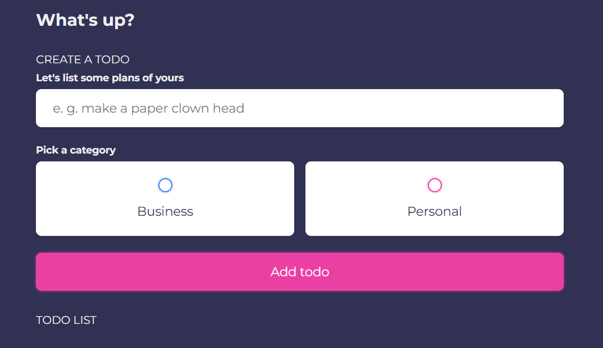

# 📝 ToDo List with Vue & Drag-n-Drop

A lightweight Vue 3 ToDo app that lets you manage your tasks smoothly with drag-and-drop sorting, localStorage persistence, and optional real-time sync using WebSocket.

---

## 📸 Screenshot

Add your screenshot to `assets/screenshots/todo-screenshot.png` and reference it here:

```markdown

```

---

## ⚙️ Features

* **Add / edit / remove todos** — manage your daily tasks easily.
* **Categories** — choose between **Business** and **Personal**.
* **Mark as done** — checkbox to mark tasks completed.
* **Drag-and-drop reorder** — powered by [Sortable.js].
* **Auto-save to localStorage** — your tasks stay between page reloads.
* **Optional WebSocket sync** — real-time updates between multiple clients.

---

## 🧩 File Structure

```
index.html                 # Main HTML file
assets/
 ├─ css/main.css           # Styles
 ├─ js/vue.js              # Vue runtime (local copy or CDN)
 ├─ js/app.js              # App source code
 └─ screenshots/todo-screenshot.png  # Screenshot for README
```

---

## 🚀 Run Locally

No build tools are required. Simply serve the project folder with any static server:

```bash
# Using http-server (Node.js)
npx http-server . -p 3000

# Using Python 3
python -m http.server 3000
```

Open [http://localhost:3000](http://localhost:3000) in your browser.

> Note: Opening `index.html` directly may block WebSocket and localStorage features in some browsers.

---

## 🔗 WebSocket (Optional)

The app connects to `ws://localhost:8080` for optional real-time sync.

Minimal Node.js WebSocket server example:

```js
const WebSocket = require('ws');
const wss = new WebSocket.Server({ port: 8080 });
let lastState = null;

wss.on('connection', ws => {
  if (lastState) ws.send(lastState);

  ws.on('message', msg => {
    lastState = msg;
    wss.clients.forEach(client => {
      if (client !== ws && client.readyState === WebSocket.OPEN) {
        client.send(msg);
      }
    });
  });
});

console.log('WebSocket server running on ws://localhost:8080');
```

Run:

```bash
npm install ws
node server.js
```

> For production, implement proper validation and authentication.

---

## 🧠 Tech Stack

* **Vue 3** — reactive frontend framework
* **Sortable.js** — drag-and-drop support
* **Google Fonts** — Montserrat

---

## ⚠️ Notes

* Todos are sorted by `date` descending.
* Currently, todos are identified by object reference; adding a unique `id` is recommended.
* Incoming WebSocket messages replace local state; merge strategies can be added for conflict resolution.

---

## 📝 License

MIT — feel free to use, modify, and distribute.

---

This README is ready to paste into GitHub as-is, with full instructions and code examples.
